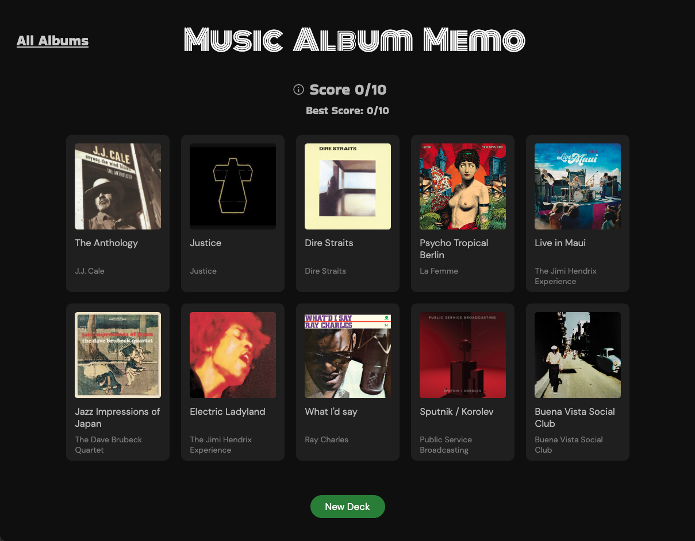

# Music Album Memo

[Check live!](https://mrzadzinski.github.io/music-album-memo/)

Memory card game displaying some of my favorite music albums.

## Features
* Click each card only once to win
* Build random decks from pool of 30 albums
* See your current score and best score
* Check all albums at once in separate tab

## Technologies
* React
* JSX
* Javascript
* SCSS

## Skills practiced
* Functional components and hooks
* Utilizing component lifecycle with useEffect
* Usage of props and state
* Dealing with unidirectional data flow
* JSX syntax

## Acknowledgments
* Whole design was heavily inspired by Spotify desktop app
* This project was an assignment from The Odin Project course: [Memory Card](https://www.theodinproject.com/lessons/node-path-javascript-memory-card)
